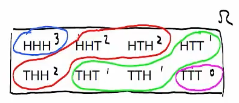

# Probability with random variables

Example: 3 coin flips:

{HHH, HHT, HTH, HTT, THH, THT, TTH, TTT}

X = number of H

𝑥 = {0, 1, 2, 3}

X(HTH) = 2

When we write `X = 𝑥` for any value what we are really thinking of is a set of outcomes such that the labeling of these outcomes is equal to a particular value of x (set of outcomes = event)

`X = 𝑥 -> {X = 𝑥} = {ω: X(ω) = 𝑥}`

Px(𝑥) = ℙ(X = 𝑥) = ℙ({ω: X(ω) = 𝑥})

Px(𝑥) = Probability mass function (PMF)
