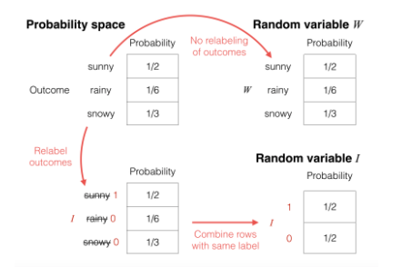

# Random variables

(Ω, ℙ)

| Ω     | ℙ   |
| ----- | --- |
| sunny | 1/2 |
| rainy | 1/6 |
| snowy | 1/3 |

ω = sampled from (Ω, ℙ)

Set W as the random variable equal to omega which is true for omega being any the possible outcomes:

`W = ω -> ∀ ω ∈ {sunny,rainy,snowy}`

* ∀ -> for all
* ∈ -> is an element of

I = 1 if ω ∈ {sunny,rainy,snowy} and 0 if ω ∈ {rainy,snowy}

W maps from Ω -> Ω or `W = Ω`

I maps from Ω -> {0, 1} or `I = {0,1}`

### In general

Given a probabiltiy space (Ω, ℙ)

random variable X is going to be a function that maps from the sample space to some "alphabet" aka the set of values that random variable X takes on:

`r.v. X: Ω -> 𝑥`

#### W

| Ω     | ℙ   |
| ----- | --- |
| sunny | 1/2 |
| rainy | 1/6 |
| snowy | 1/3 |

#### I

| Ω  | ℙ   |
| -- | --- |
| 1  | 1/2 |
| 0  | 1/6 |
| 0  | 1/3 |

or

| Ω  | ℙ   |
| -- | --- |
| 1  | 1/2 |
| 0  | 1/2 |

------

## Addendum

A “random variable" really is just reassigning/relabeling what the values are for the possible outcomes in the underlying probability space.

